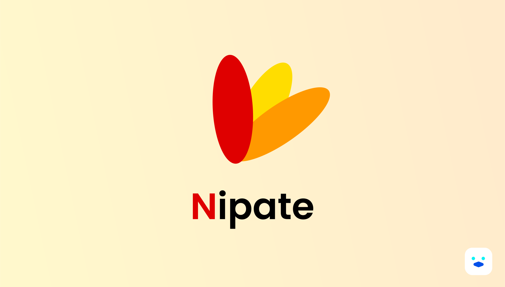

<div align='center'>

<br/>


# Nipate Client

[🎓 About](#about-this-repository-🎓) •
[👨🏿‍💻 Installation](#project-setup-👨🏿‍💻) •
[🛠️ Building](#building-project-🛠️) •
[🧪 Testing](#testing-🧪) •
[📖 Documentation](#documentation-📖)

</div>

### About this repository 🎓

<div align='center'>

</div>

This repository holds the codebase for nipate web application.
Its a `react + nextjs` web application, this is where nipate customers would be able to access nipate services.

### Project Setup 👨🏿‍💻

This is a node npm application, with typescript. All configurations are included so one hase to follow the steps only

`Project Setup`

To setup the application first clone the repository.

```bash
git clone <REPO>
```

`Dependacies Installation`

To install project dependacies, run

```bash
yarn install

# For NPM users

npm install
```

### Building Project 🛠️

This project has the web server and documentation server. You can build or run the servers as follows.

`Running application server`

To run the application server execute

```bash
yarn dev

# NPM users

npm run dev
```

### Testing 🧪

The project uses `jest + storybook interactions` for testing. You can test the application components as follows.

```bash
yarn test

# NPM users

npm run test
```

### Documentation 📖

The application documentation can be found in [nipate storybook pages](#documentation-📖) for ui - frontend documentation.
